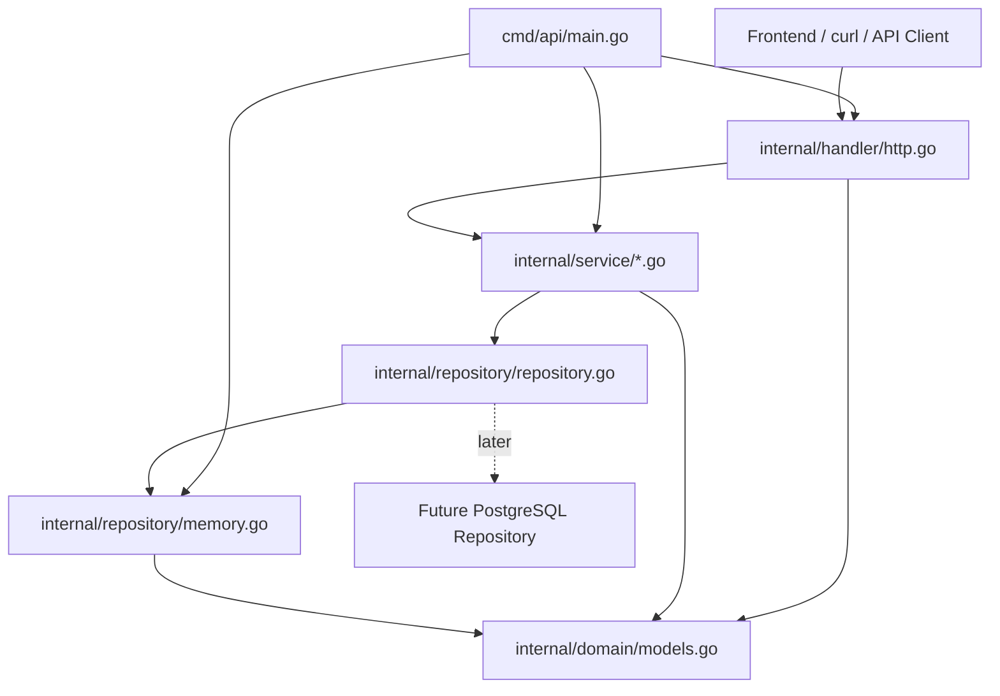
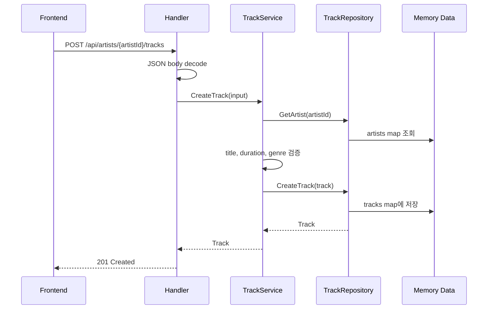
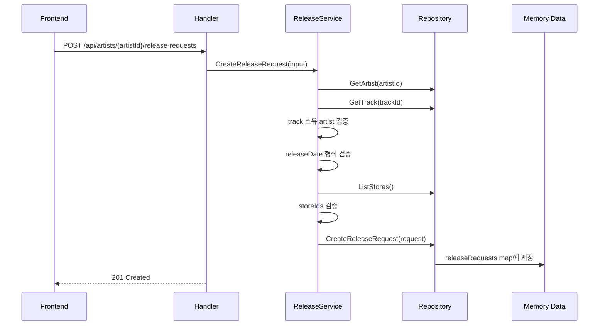
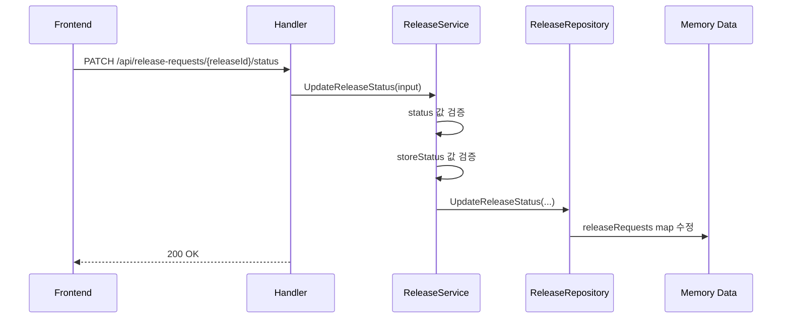

# Backend Architecture

이 문서는 `backend/` 폴더의 전체 파일 구조와 각 계층의 역할을 설명합니다. 이 프로젝트는 초보자가 Go REST API의 기본 구조를 공부하기 쉽도록 `handler`, `service`, `repository`, `domain` 계층으로 나누었습니다.

## 전체 구조

```text
backend/
  go.mod
  cmd/
    api/
      main.go
  internal/
    domain/
      models.go
    handler/
      http.go
    service/
      artist_service.go
      track_service.go
      release_service.go
      sales_service.go
    repository/
      repository.go
      memory.go
```

## 계층 구조



의존 방향은 위에서 아래로 흐릅니다.

- `handler`는 HTTP 요청과 응답만 다룹니다.
- `service`는 비즈니스 규칙을 다룹니다.
- `repository`는 데이터를 읽고 쓰는 방법을 감춥니다.
- `domain`은 모든 계층이 공유하는 핵심 타입입니다.

## 파일별 역할

### `go.mod`

Go 모듈 이름과 Go 버전을 정의합니다.

현재는 Go 표준 라이브러리만 사용하므로 외부 의존성이 없습니다. 초보자 학습용으로 API 구조 자체에 집중하기 좋습니다.

### `cmd/api/main.go`

서버 실행 진입점입니다.

주요 책임:

- `MemoryRepository` 생성
- 각 service 생성
- router 생성
- `http.ListenAndServe(":8080", router)`로 API 서버 실행

현재 연결 구조:

```go
repo := repository.NewMemoryRepository()

artistService := service.NewArtistService(repo)
trackService := service.NewTrackService(repo, repo)
releaseService := service.NewReleaseService(repo, repo, repo, repo)
salesService := service.NewSalesService(repo, repo)
```

여기서 `repo` 하나가 여러 repository interface를 구현합니다. 나중에 PostgreSQL로 바꿀 때는 이 위치에서 `NewPostgresRepository(...)` 같은 구현체로 교체하면 됩니다.

### `internal/domain/models.go`

서비스의 핵심 도메인 모델을 정의합니다.

주요 타입:

- `Artist`: 아티스트 기본 정보
- `Track`: 곡 메타데이터
- `Store`: Spotify, Apple Music, LINE MUSIC 같은 배포 스토어
- `ReleaseRequest`: 배포 신청
- `StoreDelivery`: 스토어별 배포 상태
- `SalesReport`: 월별, 스토어별 수익 데이터
- `ReleaseStatus`: 전체 배포 신청 상태 enum
- `StoreDeliveryStatus`: 스토어별 배포 상태 enum

이 파일은 특정 저장소나 HTTP에 의존하지 않습니다. 그래서 DB가 in-memory에서 PostgreSQL로 바뀌어도 도메인 모델은 그대로 유지할 수 있습니다.

### `internal/repository/repository.go`

저장소 interface를 정의합니다.

주요 interface:

- `ArtistRepository`
- `TrackRepository`
- `StoreRepository`
- `ReleaseRepository`
- `SalesRepository`

service는 concrete struct인 `MemoryRepository`를 직접 알지 않고, 이 interface만 의존합니다.

이 구조의 장점:

- 지금은 in-memory로 빠르게 개발 가능
- 나중에 PostgreSQL repository를 추가해도 service 코드를 크게 바꾸지 않아도 됨
- 테스트할 때 mock repository를 넣기 쉬움

### `internal/repository/memory.go`

in-memory 저장소 구현입니다.

현재는 아래 데이터를 메모리에 보관합니다.

- artists
- tracks
- stores
- releaseRequests
- salesReports

`MemoryRepository`는 `repository.go`에 정의된 여러 interface를 모두 구현합니다.

예를 들어 `CreateTrack`은 다음 흐름으로 동작합니다.

1. artist가 존재하는지 확인
2. 새 track ID 생성
3. `CreatedAt` 설정
4. map에 저장
5. 생성된 track 반환

주의할 점:

- 서버를 재시작하면 새로 등록한 곡과 배포 신청은 사라집니다.
- 동시 요청을 고려해 `sync.RWMutex`를 사용합니다.
- 실제 서비스에서는 이 파일이 PostgreSQL 구현체로 교체됩니다.

### `internal/service/artist_service.go`

아티스트 조회 use case를 담당합니다.

현재 기능:

- 아티스트 목록 조회
- 아티스트 상세 조회

현재는 단순 조회라 로직이 적지만, 실제 서비스라면 여기에서 권한 확인이나 소속 레이블 확인 같은 규칙을 추가할 수 있습니다.

### `internal/service/track_service.go`

곡 등록과 곡 목록 조회 use case를 담당합니다.

현재 비즈니스 규칙:

- 곡을 등록하기 전에 artist가 존재하는지 확인
- `title`은 필수
- `durationSeconds`는 0보다 커야 함
- genre가 비어 있으면 artist의 primary genre를 기본값으로 사용
- language가 비어 있으면 `ja`를 기본값으로 사용

HTTP handler는 이 규칙을 알 필요가 없습니다. handler는 요청 body를 읽고 service에 넘기는 역할만 합니다.

### `internal/service/release_service.go`

배포 신청과 배포 상태 변경 use case를 담당합니다.

현재 비즈니스 규칙:

- 배포 신청 전 artist 존재 확인
- track 존재 확인
- track이 해당 artist의 곡인지 확인
- release date는 `YYYY-MM-DD` 형식이어야 함
- 최소 1개 이상의 store를 선택해야 함
- 존재하지 않는 store ID는 오류 처리
- 전체 release status 값 검증
- store delivery status 값 검증

음악 유통 플랫폼에서 가장 중요한 흐름이 이 파일에 모여 있습니다.

### `internal/service/sales_service.go`

수익 리포트 조회 use case를 담당합니다.

현재 기능:

- artist가 존재하는지 확인
- 해당 artist의 sales report 목록 조회

실제 서비스로 확장하면 월별 집계, 스토어별 집계, 국가별 집계, 통화 변환 같은 로직을 여기에 추가할 수 있습니다.

### `internal/handler/http.go`

REST API endpoint를 정의하고 HTTP 요청/응답을 처리합니다.

주요 책임:

- URL path 파싱
- HTTP method 분기
- JSON request body decode
- service 호출
- JSON response encode
- CORS 처리
- error를 HTTP status code로 변환

handler는 비즈니스 규칙을 직접 처리하지 않습니다. 예를 들어 "곡 제목은 필수" 같은 규칙은 `TrackService`가 담당합니다.

## 요청 흐름 예시

### 곡 등록



### 배포 신청 생성



### 배포 상태 변경



## REST API와 연결되는 파일

| Endpoint | Handler 함수 | Service |
| --- | --- | --- |
| `GET /health` | `handleHealth` | 없음 |
| `GET /api/stores` | `handleStores` | `ReleaseService.ListStores` |
| `GET /api/artists` | `handleArtists` | `ArtistService.ListArtists` |
| `GET /api/artists/{artistId}` | `handleArtistDetail` | `ArtistService.GetArtist` |
| `GET /api/artists/{artistId}/tracks` | `handleTracks` | `TrackService.ListTracks` |
| `POST /api/artists/{artistId}/tracks` | `handleTracks` | `TrackService.CreateTrack` |
| `GET /api/artists/{artistId}/release-requests` | `handleReleaseRequests` | `ReleaseService.ListReleaseRequests` |
| `POST /api/artists/{artistId}/release-requests` | `handleReleaseRequests` | `ReleaseService.CreateReleaseRequest` |
| `PATCH /api/release-requests/{releaseId}/status` | `handleReleaseSubroutes` | `ReleaseService.UpdateReleaseStatus` |
| `GET /api/artists/{artistId}/sales-reports` | `handleSalesReports` | `SalesService.ListSalesReports` |

## PostgreSQL로 교체할 때 바뀌는 부분

PostgreSQL을 붙일 때 가장 먼저 추가할 파일 예시는 다음과 같습니다.

```text
backend/internal/repository/
  postgres.go
```

`postgres.go`는 `repository.go`의 interface들을 구현해야 합니다.

예상 구조:

```go
type PostgresRepository struct {
	db *sql.DB
}

func NewPostgresRepository(db *sql.DB) *PostgresRepository {
	return &PostgresRepository{db: db}
}
```

그 다음 `cmd/api/main.go`에서 repository 생성 부분만 바꿉니다.

```go
repo := repository.NewPostgresRepository(db)
```

이렇게 하면 handler와 service는 큰 변경 없이 유지할 수 있습니다.

## 왜 이런 구조를 쓰는가

### handler와 service를 분리하는 이유

HTTP는 입력 방식일 뿐입니다. 나중에 CLI, batch job, GraphQL 같은 다른 입력 방식이 생겨도 service를 재사용할 수 있습니다.

### service와 repository를 분리하는 이유

비즈니스 규칙과 데이터 저장 방식을 분리하기 위해서입니다. 지금은 map에 저장하지만, 나중에는 PostgreSQL, Redis, 외부 API 등으로 바뀔 수 있습니다.

### domain을 따로 두는 이유

`Artist`, `Track`, `ReleaseRequest` 같은 핵심 개념은 handler, service, repository 모두에서 공유됩니다. 한 곳에 모아두면 타입을 기준으로 전체 서비스를 이해하기 쉽습니다.

## 공부 순서 추천

1. `internal/domain/models.go`에서 도메인 타입을 먼저 읽기.
2. `internal/repository/repository.go`에서 어떤 데이터 작업이 필요한지 확인하기.
3. `internal/service/track_service.go`에서 검증 로직이 어디에 들어가는지 보기.
4. `internal/handler/http.go`에서 endpoint와 service 호출이 어떻게 연결되는지 보기.
5. `cmd/api/main.go`에서 전체 객체가 어떻게 조립되는지 보기.
6. 마지막으로 `internal/repository/memory.go`에서 실제 데이터가 어떻게 저장되는지 보기.
